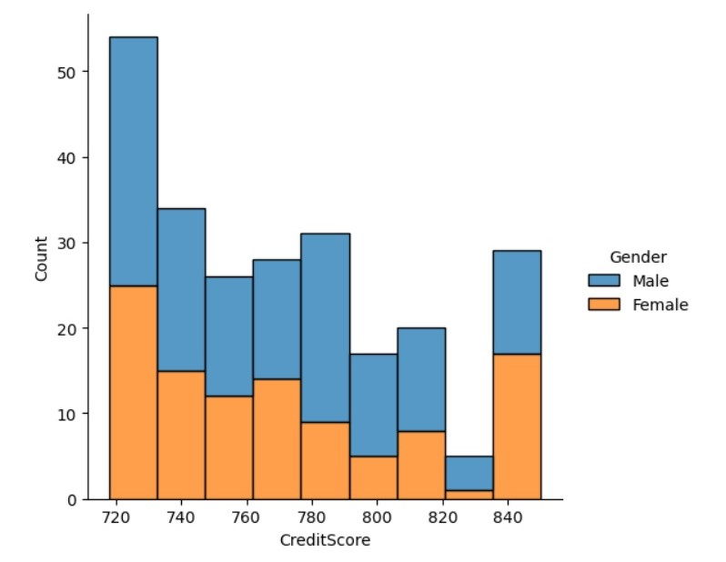

#### Решена типичная аналитическая задача из банковского сектора.
____
#### Задание:
Используя имеющиеся данные, отобрать клиентов для акции лояльности, количество участников не должно превышать 10% от общего числа клиентов.
____
#### Ссылка на используемый датасет: https://www.kaggle.com/datasets/santoshd3/bank-customers
____
С помощью библиотек pandas, numpy и seaborn были проанализированы клиенты банка и выбраны 244 человека (что состовялет 2,44% от общего числа клиентов).
____
Также были визуализированы данные:
____
## *CreditScore - Geography:*

____

## *CreditScore - Gender:*

____

## *CreditScore - Age:*

